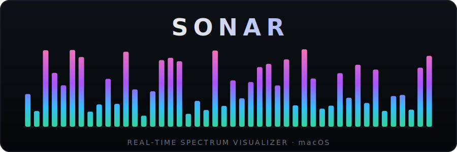

<p align="center">
  
</p>

<p align="center">
  <b>Sonar</b> is a native macOS music player with a real-time spectrum visualizer.<br>
  Winamp spirit, modern SwiftUI&nbsp;+&nbsp;vDSP build.
</p>

<p align="center">
  
  
  
  
  
</p>

---

## ✨ Features

- 📊 **Real-time spectrum visualizer** — log-spaced frequency bars with falling
  peaks, driven by a real FFT (Accelerate&nbsp;/&nbsp;vDSP). Double-click to flip
  to oscilloscope mode. 10 color themes.
- 🎵 **Local playback** — MP3, M4A, WAV, AIFF, and FLAC via AVAudioEngine.
- 📥 **YouTube → library** — paste a URL to download and convert a track straight
  into your library, with cover art and metadata embedded.
- 🎚️ **10-band equalizer** with presets.
- 🖼️ **Album artwork that breathes to the bass**, plus full ID3 metadata.
- 📚 **Library & playlist** — search, click to play, hover to delete, and resume
  exactly where you left off.
- ⌨️ **Media keys & shortcuts** — Space, ⌘← / ⌘→, ⌥← / ⌥→, and Now Playing in
  Control Center.
- 🔀 **Shuffle & repeat**, 😴 **sleep timer**, and a custom Dock icon.

## 📥 Download

Grab the latest beta from the
**[Releases page](https://github.com/afterglow1251/music-player-macos/releases/latest)** —
download `Sonar-<version>.zip`, unzip it, and drag **Sonar.app** into your
**Applications** folder.

> [!NOTE]
> **First launch.** The beta isn't notarized by Apple yet, so macOS blocks a
> plain double-click the first time. **Right-click** `Sonar.app` → **Open** →
> **Open**. On macOS Sequoia (15) or Tahoe (26), if "Open" isn't offered, go to
> **System Settings → Privacy & Security** and click **"Open Anyway"**.
> You only do this once.

## 🛠️ Build from source

**Requirements:** macOS 14+, Xcode 16+ / Swift 6. For YouTube downloads you'll
also need [`yt-dlp`](https://github.com/yt-dlp/yt-dlp) and `ffmpeg`:

```bash
brew install yt-dlp ffmpeg
```

Then run it:

```bash
swift run Sonar
```

Or open `Package.swift` in Xcode and press ▶ (Run).

Downloaded tracks are stored in **`~/Documents/Sonar/`** (reachable from Finder).

## 🎛️ How the visualizer works

Audio samples are tapped from the output, run through an FFT (Accelerate / vDSP),
grouped into log-spaced frequency bands (bass on the left → treble on the right),
and drawn as stacked colored tiles. Peaks snap up and fall under simulated gravity.

## 📄 License

Released under the [MIT License](LICENSE).
